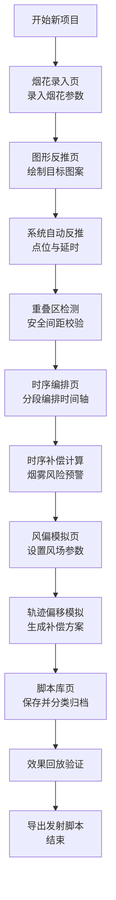

## 1. 产品概述

烟花齐射空中排布发射时序与图形成形生产力系统，是面向专业烟花燃放设计师的桌面客户端工具。系统解决传统烟花燃放设计中依赖经验、难以精确控制空中图案成形效果的痛点，提供从烟花参数录入、图形反推、时序编排、风偏模拟到脚本管理的全流程数字化设计能力。

- 面向用户：烟花燃放设计师、烟火表演策划师、烟花工程技术人员
- 核心价值：将空中图案精确转化为发射时序，保障齐射同步性与安全性，提升烟花表演的艺术表现力与工程可靠性

---

## 2. 核心功能

### 2.1 用户角色

| 角色 | 注册方式 | 核心权限 |
|------|----------|----------|
| 设计师 | 本地授权 | 烟花库管理、图形设计、时序编排、模拟验证、脚本导出 |
| 管理员 | 本地授权 | 系统配置、安全参数设置、脚本库全局管理 |

### 2.2 功能模块

1. **烟花录入页**：烟花型号参数管理，升空时间、炸高、散开半径录入
2. **图形反推页**：目标空中图案绘制，自动反推发射点位与延时配置
3. **时序编排页**：齐射时序计算、时间轴分段编排、烟雾风险预警
4. **风偏模拟页**：风速风向参数设置，升空轨迹与炸点偏移模拟
5. **脚本库页**：按主题分类管理图形脚本，支持导入导出与效果回放

### 2.3 页面详情

| 页面名称 | 模块名称 | 功能描述 |
|----------|----------|----------|
| 烟花录入页 | 烟花参数表单 | 录入烟花型号、升空时间(秒)、炸高(米)、散开半径(米)、颜色、效果类型 |
| 烟花录入页 | 烟花列表管理 | 增删改查烟花型号，支持批量导入导出，参数校验 |
| 烟花录入页 | 效果预览卡片 | 可视化展示单烟花炸开效果与参数指标 |
| 图形反推页 | 图案画布 | SVG绘制目标空中图案，支持文字、几何图形、自由绘制 |
| 图形反推页 | 点位反推引擎 | 根据图案轮廓自动计算发射点位分布与发射延时 |
| 图形反推页 | 重叠区识别 | 标识图形重叠区域，给出避让调整建议 |
| 图形反推页 | 安全间距校验 | 检测相邻发射管间距是否符合安全标准，生成坠落保护区 |
| 时序编排页 | 时序补偿计算 | 计算多发齐射时在同一高度同时绽放的时序补偿值 |
| 时序编排页 | 时间轴编辑器 | 将整场拆分为多个齐射段落，拖拽调整段落时序 |
| 时序编排页 | 发射脚本生成 | 生成精确到毫秒的发射时序脚本 |
| 时序编排页 | 烟雾预警系统 | 检测同时点火数量，对烟雾遮挡风险进行分级预警 |
| 时序编排页 | 效果回放 | 模拟整场烟花燃放效果，支持倍速播放与暂停 |
| 风偏模拟页 | 风场参数设置 | 设置不同高度层的风速、风向参数 |
| 风偏模拟页 | 轨迹模拟 | 物理模拟烟花升空轨迹偏移，实时显示炸点偏差 |
| 风偏模拟页 | 补偿建议 | 基于风偏模拟给出发射角度与延时补偿建议 |
| 脚本库页 | 主题分类管理 | 按节日、庆典、商业活动等主题分类归档脚本 |
| 脚本库页 | 脚本预览回放 | 快速预览脚本效果，查看关键参数指标 |
| 脚本库页 | 导入导出 | 支持JSON格式脚本文件的导入导出 |
| 脚本库页 | 版本记录 | 记录每场发射脚本与实际效果反馈 |

---

## 3. 核心流程

用户从创建新设计项目开始，首先录入可用烟花型号参数，然后在画布上绘制目标空中图案，系统自动反推发射点位与延时；接着进行齐射时序编排，计算时序补偿并检测烟雾风险；随后进行风偏模拟验证，获取补偿建议；最终保存设计脚本至脚本库，可随时回放或导出。

---

## 4. 用户界面设计

### 4.1 设计风格

**设计方向**：科技工业风 + 烟花视觉元素，专业生产力工具定位
- **主色调**：深空蓝 `#0a1628` 为背景，体现夜空氛围
- **强调色**：焰火橙 `#ff6b35`、爆裂金 `#ffd700`、信号红 `#ff4757`，呼应烟花主题
- **辅助色**：科技青 `#00d4ff` 用于数据可视化，安全绿 `#2ed573` 用于校验通过标识
- **按钮风格**：微立体倒角按钮，悬停时有辉光效果，危险操作采用红色警示边框
- **字体**：标题使用 `Orbitron` 科技感字体，正文使用 `JetBrains Mono` 等宽字体保障数据可读性
- **布局风格**：三栏式专业工具布局，左侧导航+中间工作区+右侧参数面板，支持面板拖拽浮动
- **图标风格**：线性图标配合微动画，按钮点击时有粒子爆裂效果呼应烟花主题
- **视觉细节**：全局使用微妙的网格背景与辉光效果，模拟夜空星光与烟花余韵

### 4.2 页面设计概述

| 页面名称 | 模块名称 | UI元素 |
|----------|----------|--------|
| 烟花录入页 | 参数表单 | 分组卡片布局，数值输入框带单位标签，颜色选择器带烟花效果预览 |
| 烟花录入页 | 烟花列表 | 数据表格行悬停放大效果，操作列固定在右侧 |
| 图形反推页 | 图案画布 | 深色画布背景带网格，SVG绘制带吸附对齐功能，缩放控制栏 |
| 图形反推页 | 点位可视化 | 发射点用不同颜色标识，重叠区用半透明红色遮罩闪烁提示 |
| 时序编排页 | 时间轴 | 多轨道时间轴，不同烟花类型用不同颜色条块，支持缩放与框选 |
| 时序编排页 | 预警面板 | 风险等级用颜色标识（绿/黄/红），点击查看详情与建议 |
| 风偏模拟页 | 3D轨迹视图 | Three.js场景展示烟花升空轨迹，风场用箭头粒子可视化 |
| 脚本库页 | 卡片网格 | 脚本卡片悬停时播放预览动画，封面用烟花效果截图 |

### 4.3 响应式

- 桌面端优先设计，固定侧边栏宽度，工作区自适应
- 支持窗口缩放，面板可折叠收起
- 画布区域支持鼠标滚轮缩放与拖拽平移
- 最小支持分辨率：1280×800

### 4.4 3D场景指导（风偏模拟页）

- **环境**：深邃夜空背景，星星粒子点缀，地面发射阵地网格
- **光照**：环境光提供基础照明，发射时产生动态点光源模拟烟花爆炸
- **相机**：透视相机，可环绕观察，预设多个视角（侧视、俯视、跟随）
- **动画**：烟花升空轨迹用拖尾粒子效果，爆炸时粒子向四周扩散
- **后处理**：辉光效果增强烟花视觉表现，色彩分级营造电影感
- **性能**：烟花粒子池复用，单屏粒子数量控制在2000以内
