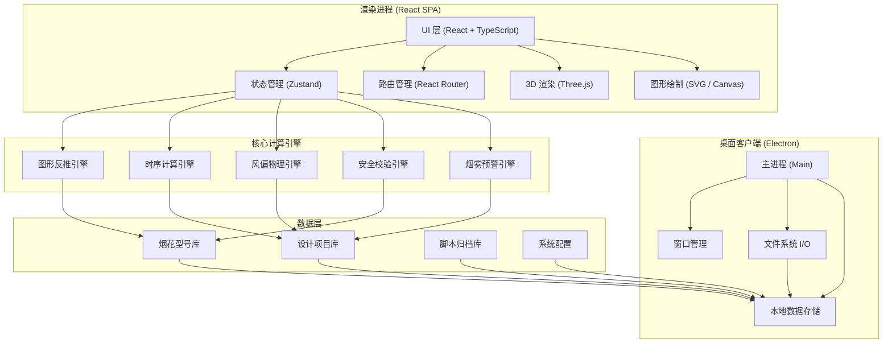
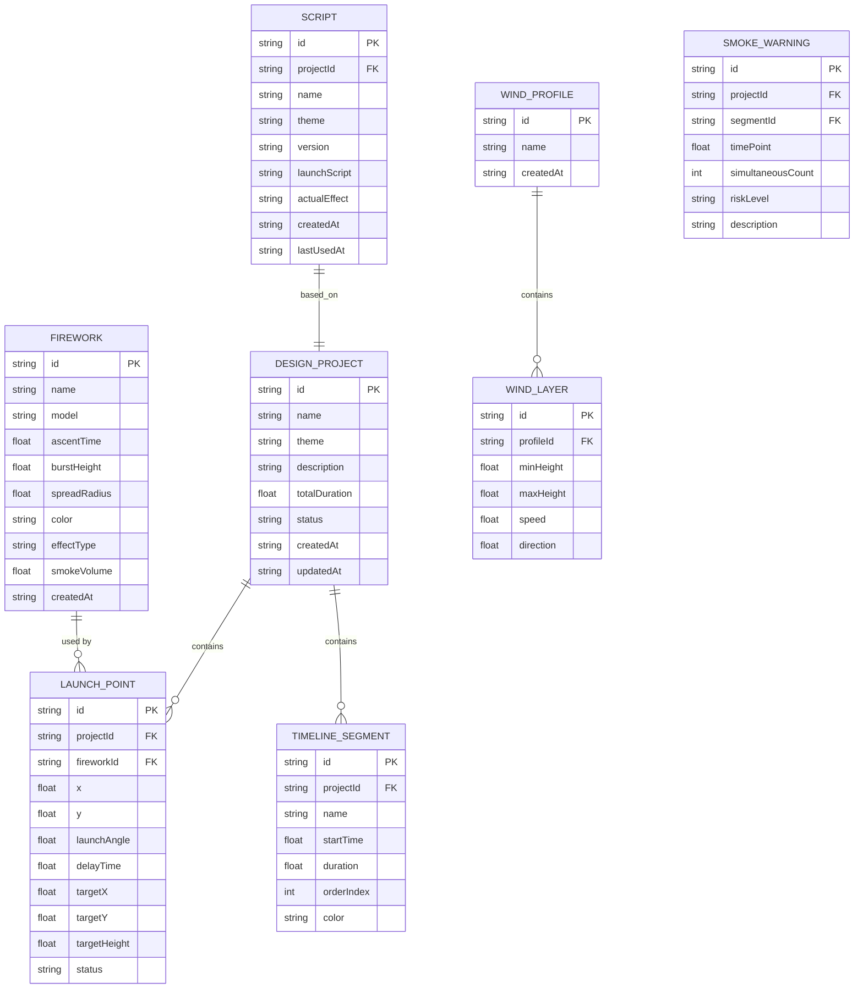

## 1. 架构设计



---

## 2. 技术描述

- **前端框架**：React@18 + TypeScript + Vite@5
- **桌面壳**：Electron@28（桌面客户端形式，本地文件操作）
- **样式方案**：TailwindCSS@3 + CSS 变量（主题系统）
- **状态管理**：Zustand@4（轻量级，适合复杂业务状态）
- **路由管理**：React Router@6
- **3D 渲染**：Three@0.160 + @react-three/fiber@8 + @react-three/drei@9
- **图形绘制**：原生 SVG + Canvas API
- **数据存储**：IndexedDB + 本地 JSON 文件
- **图标库**：Lucide React（线性图标）
- **动画方案**：Framer Motion + CSS Keyframes
- **开发工具**：electron-vite（一体化构建）

---

## 3. 路由定义

| 路由 | 页面组件 | 页面名称 |
|------|----------|----------|
| `/fireworks` | `FireworksPage` | 烟花录入页 |
| `/pattern` | `PatternPage` | 图形反推页 |
| `/timeline` | `TimelinePage` | 时序编排页 |
| `/wind` | `WindSimulationPage` | 风偏模拟页 |
| `/library` | `LibraryPage` | 脚本库页 |
| `/` | 重定向到 `/fireworks` | - |

---

## 4. 数据模型

### 4.1 数据模型定义



### 4.2 TypeScript 类型定义

```typescript
// 烟花型号
interface Firework {
  id: string;
  name: string;
  model: string;
  ascentTime: number;      // 升空时间(秒)
  burstHeight: number;     // 炸高(米)
  spreadRadius: number;    // 散开半径(米)
  color: string;           // 主颜色
  effectType: 'peony' | 'chrysanthemum' | 'willow' | 'ring' | 'comet' | 'palm';
  smokeVolume: number;     // 烟量系数 0-1
  createdAt: string;
}

// 发射点位
interface LaunchPoint {
  id: string;
  projectId: string;
  fireworkId: string;
  x: number;               // 发射点X坐标(米)
  y: number;               // 发射点Y坐标(米)
  launchAngle: number;     // 发射角度(度)
  delayTime: number;       // 发射延时(毫秒)
  targetX: number;         // 目标炸点X
  targetY: number;         // 目标炸点Y
  targetHeight: number;    // 目标炸高
  status: 'pending' | 'calculated' | 'adjusted';
}

// 设计项目
interface DesignProject {
  id: string;
  name: string;
  theme: string;
  description: string;
  totalDuration: number;   // 总时长(秒)
  launchPoints: LaunchPoint[];
  timelineSegments: TimelineSegment[];
  status: 'draft' | 'completed' | 'archived';
  createdAt: string;
  updatedAt: string;
}

// 时间轴段落
interface TimelineSegment {
  id: string;
  projectId: string;
  name: string;
  startTime: number;       // 开始时间(秒)
  duration: number;        // 持续时间(秒)
  orderIndex: number;
  color: string;
  launchPointIds: string[];
}

// 风场配置
interface WindLayer {
  minHeight: number;
  maxHeight: number;
  speed: number;           // 风速(m/s)
  direction: number;       // 风向(度，0度为正北)
}

interface WindProfile {
  id: string;
  name: string;
  layers: WindLayer[];
  createdAt: string;
}

// 脚本
interface Script {
  id: string;
  projectId: string;
  name: string;
  theme: string;
  version: string;
  launchScript: LaunchCommand[];
  actualEffect?: string;
  createdAt: string;
  lastUsedAt?: string;
}

// 发射命令
interface LaunchCommand {
  time: number;            // 发射时间(毫秒)
  fireworkId: string;
  tubeNumber: string;
  angle: number;
}

// 烟雾预警
interface SmokeWarning {
  id: string;
  timePoint: number;
  simultaneousCount: number;
  riskLevel: 'low' | 'medium' | 'high' | 'critical';
  description: string;
}

// 安全校验结果
interface SafetyCheckResult {
  passed: boolean;
  issues: SafetyIssue[];
}

interface SafetyIssue {
  type: 'spacing' | 'fallZone' | 'overlap';
  severity: 'warning' | 'error';
  message: string;
  location?: { x: number; y: number };
}
```

---

## 5. 核心计算引擎接口

### 5.1 图形反推引擎

```typescript
interface PatternInferenceEngine {
  // 根据SVG图案反推发射点位
  inferLaunchPoints(
    svgPath: string,
    fireworks: Firework[],
    targetHeight: number
  ): LaunchPoint[];
  
  // 检测图形重叠区域
  detectOverlaps(points: LaunchPoint[]): OverlapRegion[];
  
  // 安全间距校验
  checkSafetySpacing(points: LaunchPoint[], minSpacing: number): SafetyCheckResult;
}

interface OverlapRegion {
  id: string;
  centerX: number;
  centerY: number;
  radius: number;
  affectedPointIds: string[];
  suggestion: string;
}
```

### 5.2 时序计算引擎

```typescript
interface TimingEngine {
  // 计算齐射时序补偿
  calculateTimingCompensation(
    points: LaunchPoint[],
    targetBurstTime: number
  ): Map<string, number>;
  
  // 确保多发在同一高度同时绽放
  synchronizeBurstHeight(
    points: LaunchPoint[],
    targetHeight: number
  ): LaunchPoint[];
  
  // 生成发射脚本
  generateLaunchScript(
    points: LaunchPoint[],
    segments: TimelineSegment[]
  ): LaunchCommand[];
}
```

### 5.3 风偏物理引擎

```typescript
interface WindPhysicsEngine {
  // 模拟单枚烟花升空轨迹
  simulateTrajectory(
    point: LaunchPoint,
    windProfile: WindProfile
  ): TrajectoryPoint[];
  
  // 计算炸点偏移量
  calculateBurstOffset(
    point: LaunchPoint,
    windProfile: WindProfile
  ): { offsetX: number; offsetY: number };
  
  // 生成补偿建议
  generateCompensation(
    point: LaunchPoint,
    windProfile: WindProfile
  ): { angleAdjust: number; delayAdjust: number };
}

interface TrajectoryPoint {
  time: number;
  x: number;
  y: number;
  height: number;
}
```

### 5.4 烟雾预警引擎

```typescript
interface SmokeWarningEngine {
  // 分析烟雾遮挡风险
  analyzeSmokeRisk(
    script: LaunchCommand[],
    fireworks: Map<string, Firework>
  ): SmokeWarning[];
  
  // 获取某时间点同时点火数量
  getSimultaneousCount(
    script: LaunchCommand[],
    timeWindow: number
  ): number;
}
```

---

## 6. 项目文件结构

```
src/
├── main/                # Electron 主进程
│   ├── main.ts
│   ├── preload.ts
│   └── ipc/             # IPC 通信处理
├── renderer/            # React 渲染进程
│   ├── App.tsx
│   ├── main.tsx
│   ├── router.tsx
│   ├── pages/           # 5个页面组件
│   │   ├── FireworksPage/
│   │   ├── PatternPage/
│   │   ├── TimelinePage/
│   │   ├── WindSimulationPage/
│   │   └── LibraryPage/
│   ├── components/      # 公共组件
│   │   ├── Layout/
│   │   ├── Sidebar/
│   │   └── common/
│   ├── store/           # Zustand 状态管理
│   │   ├── useFireworkStore.ts
│   │   ├── useProjectStore.ts
│   │   └── useTimelineStore.ts
│   ├── engine/          # 核心计算引擎
│   │   ├── PatternEngine.ts
│   │   ├── TimingEngine.ts
│   │   ├── WindPhysicsEngine.ts
│   │   └── SmokeWarningEngine.ts
│   ├── types/           # TypeScript 类型定义
│   ├── utils/           # 工具函数
│   ├── hooks/           # 自定义 Hooks
│   └── assets/          # 静态资源
├── shared/              # 主进程与渲染进程共享类型
└── resources/           # 应用资源
```
